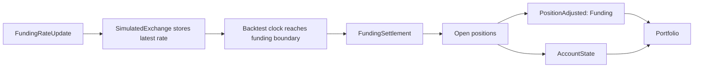

# Backtest accounts and margin

## Funding

Backtests settle perpetual funding at funding boundaries from `FundingRateUpdate` data. When an
update has `next_funding_ns`, the simulated exchange stores the latest rate and the backtest clock
emits one `FundingSettlement` at that timestamp. Without `next_funding_ns`, the exchange settles
only when `ts_event` lands on the `interval` boundary. Updates without a boundary remain strategy
data and do not create funding payments.



`PositionAdjusted` remains the position accounting event. A positive funding rate debits long
positions and credits short positions. The resulting adjustment changes realized PnL, and the
matching account balance update records the cash movement.

## Accounts

Every backtest venue is attached with one of three `account_type` values: `CASH`, `MARGIN`, or
`BETTING`. For the full data model, query API, and margin model reference, see
[Accounting](../accounting.md).

Example of adding a `CASH` account for a backtest venue:

```python
from nautilus_trader.adapters.binance import BINANCE_VENUE
from nautilus_trader.backtest.engine import BacktestEngine
from nautilus_trader.model.currencies import USDT
from nautilus_trader.model.enums import OmsType, AccountType
from nautilus_trader.model import Money, Currency

# Initialize the backtest engine
engine = BacktestEngine()

# Add a CASH account for the venue
engine.add_venue(
    venue=BINANCE_VENUE,  # Create or reference a Venue identifier
    oms_type=OmsType.NETTING,
    account_type=AccountType.CASH,
    starting_balances=[Money(10_000, USDT)],
)
```

## Margin models

Margin models determine how the simulated exchange reserves collateral for orders and positions in
backtest runs. The model types (`StandardMarginModel` vs `LeveragedMarginModel`), their formulas,
the default behavior, and custom model authoring are covered in the dedicated
[Accounting](../accounting.md#margin-models) guide.

This section covers only the backtest-specific configuration.

### Backtest venue configuration

Specify the margin model on `BacktestVenueConfig` via `MarginModelConfig`:

```python
from nautilus_trader.backtest.config import BacktestVenueConfig
from nautilus_trader.backtest.config import MarginModelConfig

venue_config = BacktestVenueConfig(
    name="SIM",
    oms_type="NETTING",
    account_type="MARGIN",
    starting_balances=["1_000_000 USD"],
    margin_model=MarginModelConfig(model_type="standard"),  # Options: 'standard', 'leveraged'
)
```

Available `model_type` values:

- `"leveraged"`: margin reduced by leverage (default).
- `"standard"`: fixed percentages (traditional brokers).
- Fully-qualified class path for a custom model:
  `"my_package.my_module:MyMarginModel"`.

### High-level backtest API

When using the high-level API, attach the margin model in the same way:

```python
from nautilus_trader.backtest.config import BacktestVenueConfig
from nautilus_trader.backtest.config import MarginModelConfig
from nautilus_trader.config import BacktestRunConfig

venue_config = BacktestVenueConfig(
    name="SIM",
    oms_type="NETTING",
    account_type="MARGIN",
    starting_balances=["1_000_000 USD"],
    margin_model=MarginModelConfig(
        model_type="standard",  # Traditional broker simulation
    ),
)

config = BacktestRunConfig(
    venues=[venue_config],
    # ... other config
)
```

Custom model with parameters:

```python
margin_model=MarginModelConfig(
    model_type="my_package.my_module:CustomMarginModel",
    config={
        "risk_multiplier": 1.5,
        "use_leverage": False,
        "volatility_threshold": 0.02,
    },
)
```

The model is applied to the simulated exchange during backtest execution.
