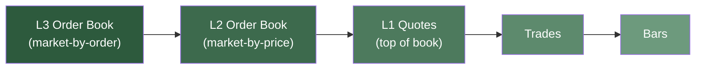

# Backtest data and venues

## Data

Data provided for backtesting drives the execution flow. Since a variety of data types can be used,
it's crucial that your venue configurations align with the data being provided for backtesting.
Mismatches between data and configuration can lead to unexpected behavior during execution.

NautilusTrader is primarily designed and optimized for order book data, which provides a complete
representation of every price level or order in the market, reflecting the real-time behavior of a
trading venue. This provides the greatest execution granularity and realism. However, if granular
order book data is either not available or necessary, then the platform has the capability of
processing market data in the following descending order of detail:

1. **Order Book Data/Deltas (L3 market-by-order)**:
   - Full market depth with visibility of all individual orders.

2. **Order Book Data/Deltas (L2 market-by-price)**:
   - Market depth visibility across all price levels.

3. **Quote Ticks (L1 market-by-price)**:
   - Top of book only - best bid and ask prices and sizes.

4. **Trade Ticks**:
   - Actual executed trades.

5. **Bars**:
   - Aggregated trading activity over fixed time intervals (e.g., 1-minute, 1-hour, 1-day).

### Choosing data: cost vs. accuracy

For many trading strategies, bar data (e.g., 1-minute) can be sufficient for backtesting and
strategy development. This is particularly important because bar data is typically much more
accessible and cost-effective compared to tick or order book data.

Given this practical reality, Nautilus is designed to support bar-based backtesting with advanced
features that maximize simulation accuracy, even when working with lower granularity data.

:::tip
For some trading strategies, it can be practical to start development with bar data to validate core
trading ideas. If the strategy looks promising, but is more sensitive to precise execution timing
(e.g., requires fills at specific prices between OHLC levels, or uses tight take-profit/stop-loss
levels), you can then invest in higher granularity data for more accurate validation.
:::

## Venues

When initializing a venue for backtesting, you must specify its internal order `book_type` for
execution processing from the following options:

- `L1_MBP`: Level 1 market-by-price (default). Only the top level of the order book is maintained.
- `L2_MBP`: Level 2 market-by-price. Order book depth is maintained, with a single order aggregated
  per price level.
- `L3_MBO`: Level 3 market-by-order. Order book depth is maintained, with all individual orders
  tracked as provided by the data.

The `book_type` determines which data types the matching engine uses to update book state and drive
execution. Data types not applicable for a given `book_type` are ignored for book and price updates,
though precision validation still applies and the engine clock still advances. Strategies always
receive all subscribed data via the data engine regardless of `book_type`.

| Data type          | L1_MBP            | L2_MBP            | L3_MBO            |
| ------------------ | ----------------- | ----------------- | ----------------- |
| `QuoteTick`        | Updates book      | *Ignored*         | *Ignored*         |
| `TradeTick`        | Triggers matching | Triggers matching | Triggers matching |
| `Bar`              | Updates book      | *Ignored*         | *Ignored*         |
| `OrderBookDelta`   | *Ignored*         | Updates book      | Updates book      |
| `OrderBookDeltas`  | *Ignored*         | Updates book      | Updates book      |
| `OrderBookDepth10` | Updates book      | Updates book      | Updates book      |

:::note
The granularity of the data must match the specified order `book_type`. Nautilus cannot generate
higher granularity data (L2 or L3) from lower-level data such as quotes, trades, or bars.
:::

:::warning
If you specify `L2_MBP` or `L3_MBO` as the venue’s `book_type`, quotes and bars will not update the
book. Ensure you provide order book delta data, otherwise orders may appear as though they are never
filled.
:::

:::warning
When using `L1_MBP` (the default), order book deltas are ignored by the matching engine. If you
subscribe to order book deltas, set the venue `book_type` to `L2_MBP` or `L3_MBO`. This also applies
to sandbox execution, where the matching engine uses the same `book_type` configuration.
:::
