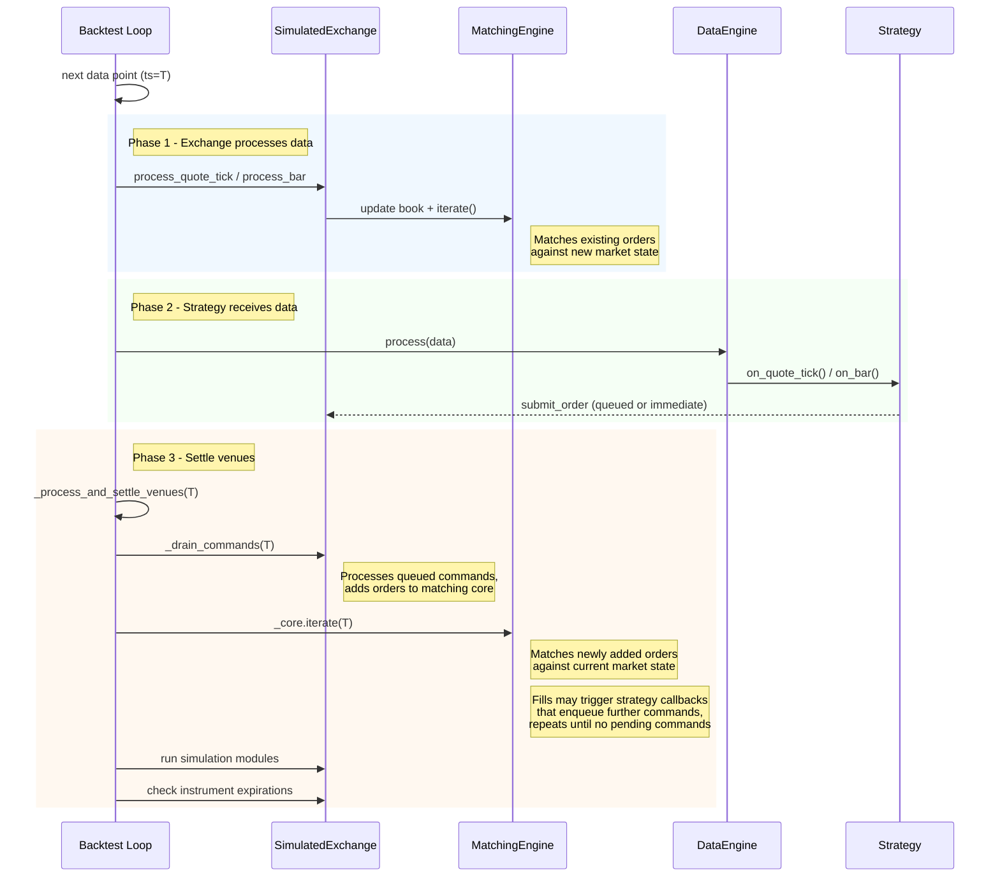

# Backtest execution flow

## Data and message sequencing

In the main backtesting loop, new market data is processed for order execution before being
dispatched to actors/strategies via the data engine.

### Main loop flow

For each data point the engine runs three phases:

- **Exchange processes data.** The simulated exchange updates its order book from
  the incoming market data and iterates the matching engine. This fills any existing
  orders that now match against the new market state.
- **Strategy receives data.** The data engine dispatches the data point to actors
  and strategies via their callbacks (e.g. `on_quote_tick`, `on_bar`). Strategies
  may submit, cancel, or modify orders during these callbacks.
- **Settle venues.** The engine drains all queued venue commands and then iterates
  matching engines to fill newly submitted orders. This loop repeats until no
  pending commands remain, so cascading orders (e.g. a hedge submitted from
  `on_order_filled`) settle within the same timestamp.

Timer events use the same settle mechanism but batch by timestamp: all callbacks at timestamp T
execute first, then venues are settled for T before advancing to T+1. For timer behavior used by
internally aggregated bars, see
[internal bar aggregation timing](bar-execution.md#internal-bar-aggregation-timing).

### Command settling

When an order fill triggers a strategy callback that submits additional orders (e.g., a stop-loss
submitted in `on_order_filled`), those cascading commands are settled within the same
timestamp/event cycle. The engine repeatedly drains venue command queues and any newly generated
commands until no commands remain pending for the current timestamp. Simulation modules are run only
once per cycle, after all commands have settled.

When a `LatencyModel` is configured, commands are placed in the venue's inflight queue with a future
timestamp derived from the simulated latency. The settle loop considers inflight commands that are
due at the current timestamp as pending, so zero-latency or same-tick latency configurations still
settle correctly. Commands with future timestamps are deferred and processed when the engine reaches
that time.

### Shutdown semantics

`BacktestEngine::end()` is separate from the `shutdown_on_error` configuration in [backtest APIs and
repeated runs](apis-and-runs.md#shutdown-on-error). It invokes each strategy's `on_stop` handler,
drains and settles any commands it emits (e.g. `close_all_positions`, `cancel_all_orders`), then
stops the engines.

- `on_stop` commands use normal venue queueing and latency. They do not get priority over earlier
  inflight commands.
- If a pre-stop order reaches the venue before an `on_stop` cancel, it may still fill. A later
  reduce-only close can then reject if the fill changed net exposure.
- Strategies that need deterministic flattening should enter an exit-only state before stopping and
  avoid new opening orders while cancel and close commands are in-flight.
- Strategy event handlers do not fire for the resulting events: the strategy is already `Stopped`,
  so `OrderFilled` and similar events log but bypass `on_order_filled` and friends. Logic that
  reacts to fills must run before `on_stop` returns.
- Simulation modules do not re-run at shutdown. `SimulationModule::process` is once per timestamp;
  re-invoking would double-apply side effects like FX rollover interest.
- A `LatencyModel` adds its configured delay to trailing commands (those emitted on the final
  data tick or in `on_stop`). The shutdown path advances the engine clock to the latest inflight
  arrival timestamp so those commands still settle before the engines stop.

## Timer-only backtests

The backtest engine supports running with timers but no market data. This is useful for scheduled
operations or testing timer-based logic. Timers fire in chronological order, and timer callbacks can
dynamically add data via `add_data_iterator()` which will be processed in sequence.

:::warning
Data added by timer callbacks at the exact start time should have timestamps **after** the start
time. The engine reads the first data point before processing start-time timers, so dynamically
added data with timestamps at or before the start time may not be processed in the expected order.
:::

## Deterministic trade IDs

The simulated exchange (used by both backtest and sandbox execution) emits a deterministic `TradeId`
for each generated fill. The ID is formatted as `T-{hash:016x}-{count:03d}`, where the 16-character
hex is an FNV-1a hash of `(venue, raw_id, ts_init)` and the trailing counter distinguishes multiple
fills at the same `ts_init` (e.g. several legs of a bar-driven fill).

**Properties**:

- Deterministic across runs: the same replayed data produces the same
  `TradeId` every time, so downstream dedup and golden-output comparisons stay
  stable.
- Collision-safe across resets: `ts_init` is pinned in backtest data and
  monotonic in live/sandbox, so a `BacktestEngine.reset()` (or an in-memory
  `IdsGenerator` reset in a sandbox with persisted orders) cannot mint a
  `TradeId` that collides with one already in the cache.
- Bounded length: the hash keeps the identifier under the 36-character
  `TradeId` cap regardless of venue name length.

The `use_random_ids` venue flag still governs `VenueOrderId` and `PositionId` generation, but
`TradeId` is always deterministic and is not affected by the flag.
