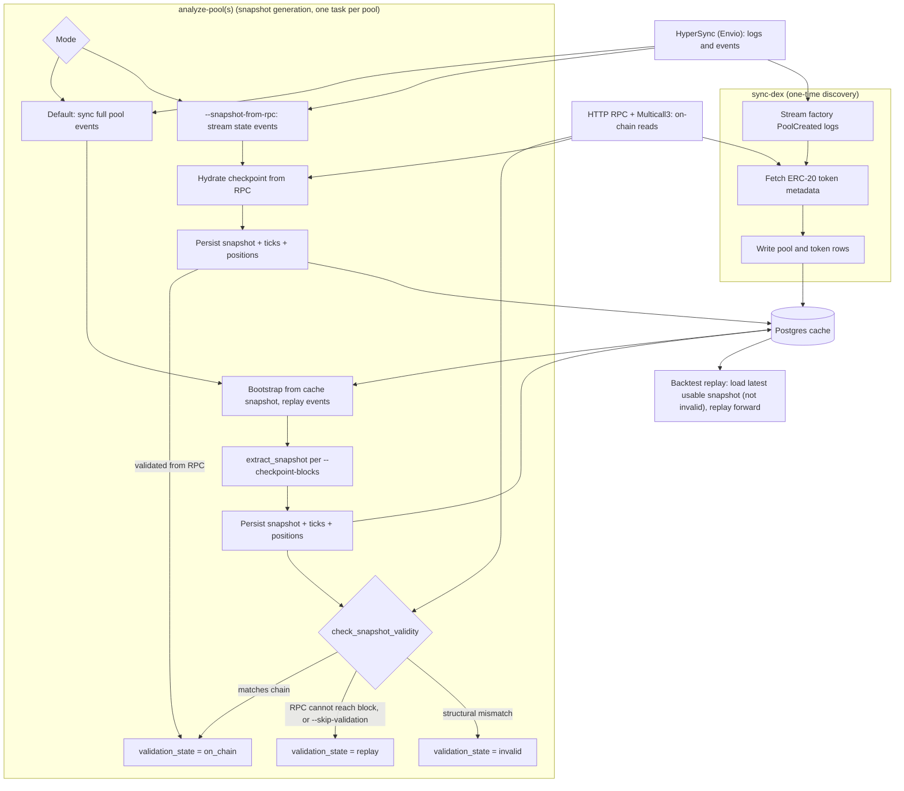

# Blockchain

## Overview

The blockchain adapter ingests DeFi data from EVM chains and exposes it through the
NautilusTrader data model. It uses three backends:

- HyperSync: high-throughput historical blocks and contract logs. See the
  [Envio HyperSync docs](https://docs.envio.dev/docs/HyperSync/hypersync-usage) for query shape,
  pagination, and tuning.
- HTTP RPC: contract calls, Multicall reads, and final on-chain state hydration.
- Postgres: optional durable cache state, pool metadata, decoded events, and snapshots.

## Core primitives

The DeFi domain model lives in `nautilus_model::defi`.

### Chain

`Chain` defines the target blockchain and its default service endpoints.

| Field                       | Type         | Description                                                        |
|-----------------------------|--------------|--------------------------------------------------------------------|
| `name`                      | `Blockchain` | Chain enum value, such as `Ethereum` or `Arbitrum`.                |
| `chain_id`                  | `u32`        | EVM chain ID, such as `1` for Ethereum.                            |
| `hypersync_url`             | `String`     | HyperSync endpoint, by default `https://{chain_id}.hypersync.xyz`. |
| `rpc_url`                   | `Option`     | Optional direct RPC endpoint stored on the chain model.            |
| `native_currency_decimals`  | `u8`         | Native gas token decimal precision, usually `18`.                  |

Chains can be loaded by numeric ID with `Chain::from_chain_id` or by name with
`Chain::from_chain_name`.

| Chain family                | Code | Name         | Decimals |
|-----------------------------|------|--------------|----------|
| Ethereum and L2s            | ETH  | Ethereum     | 18       |
| Polygon                     | POL  | Polygon      | 18       |
| Avalanche                   | AVAX | Avalanche    | 18       |
| BSC                         | BNB  | Binance Coin | 18       |

### DEX and pools

DEX integrations register:

- Factory addresses.
- Event signatures and parser functions.
- AMM type.

Pool definitions bind the chain, DEX, pool contract, token pair, fee tier, tick spacing, and creation
block into a stable Nautilus instrument ID.

Uniswap V3 and compatible concentrated-liquidity pools also use:

- `Initialize(uint160,int24)` for initial price state.
- `Mint` and `Burn` events for position and tick state replay.
- `Swap` events for live pool price movement.
- HTTP RPC final-state reads for `slot0`, liquidity, active ticks, and position data.

## Configuration

| Option                            | Default            | Description                                            |
|-----------------------------------|--------------------|--------------------------------------------------------|
| `chain`                           | Required           | Target `Chain`, such as Ethereum or Arbitrum.          |
| `dex_ids`                         | `[]`               | DEX integrations to register and sync.                 |
| `http_rpc_url`                    | Required           | HTTP RPC endpoint for contract reads and Multicall.    |
| `wss_rpc_url`                     | `None`             | Optional WSS RPC endpoint for RPC live streams.        |
| `rpc_requests_per_second`         | `None`             | Optional RPC request throttle.                         |
| `multicall_calls_per_rpc_request` | `200`              | Requested maximum Multicall targets per RPC request.   |
| `use_hypersync_for_live_data`     | `false` in Rust    | When true, live block and event streams use HyperSync. |
| `from_block`                      | `None`             | Optional start block for historical sync.              |
| `pool_filters`                    | `DexPoolFilters()` | Pool universe filtering rules.                         |
| `postgres_cache_database_config`  | `None`             | Optional Postgres cache configuration.                 |
| `proxy_url`                       | `None`             | Optional HTTP and WebSocket proxy URL.                 |
| `transport_backend`               | `Tungstenite`      | WebSocket transport backend.                           |

:::note
Pool snapshot requests currently require a Postgres cache database. The in-memory cache can hold
tokens and pools, but latest pool profiler bootstrap reads snapshot and event state through the
cache database path.
:::

## Environment

Set credentials outside the repository:

```bash
export ENVIO_API_TOKEN="<envio-token>"
export RPC_HTTP_URL="https://your-rpc.example"
export RPC_WSS_URL="wss://your-rpc.example"
```

For local `.env` usage, keep the file out of version control:

```dotenv
ENVIO_API_TOKEN=<envio-token>
RPC_HTTP_URL=https://your-rpc.example
RPC_WSS_URL=wss://your-rpc.example
```

- `ENVIO_API_TOKEN` is required by the Rust HyperSync client. Missing or malformed tokens fail
  client construction before any query is sent.
- `RPC_HTTP_URL` or `--rpc-url` is required for contract reads and snapshot hydration.
- `RPC_WSS_URL` is only needed for WSS RPC live streams.

For token setup and quota details, see Envio's
[HyperSync API token docs](https://docs.envio.dev/docs/HyperSync/api-tokens).

### RPC endpoints

`RPC_HTTP_URL` or `--rpc-url` must point at an EVM JSON-RPC endpoint for the target chain.
The data client resolves it at construction, and first-time pool syncs read on-chain state through it.
The HyperSync endpoint is derived from the chain ID (`https://{chain_id}.hypersync.xyz`).

Verified free public HTTP endpoints (June 2026, no API key):

| Chain        | HTTP endpoint                          | Archive |
| ------------ | -------------------------------------- | ------- |
| Arbitrum One | `https://arb1.arbitrum.io/rpc`         | No      |
| Arbitrum One | `https://arbitrum.gateway.tenderly.co` | Yes     |
| Ethereum     | `https://ethereum-rpc.publicnode.com`  | No      |

Free archive endpoints exist, but availability and limits change. Snapshot validation usually needs
only a small number of `eth_call`s per pool, so a free archive endpoint can be enough to get
`validation_state = on_chain`.

Archive support affects validation, not whether event sync runs:

- On an archive node, a historical-block snapshot validates against on-chain state and is stored with
  `validation_state = on_chain`.
- On a non-archive node, the historical read fails and the snapshot stays `validation_state = replay`,
  which is still usable as a replay start point.
- A first-time sync on a non-archive node must run to a recent `--to-block`, because non-archive
  nodes only serve recent state and bootstrap reads on-chain state at the target block.

For other chains or archive access, use a directory such as [chainlist.org](https://chainlist.org) or
[comparenodes.com](https://www.comparenodes.com), or a keyed provider (Infura, Alchemy, dRPC).

## Local services

The development compose file starts Postgres, Redis, and pgAdmin.

```bash
make start-services
make init-db
```

Default Postgres connection:

- Host: `127.0.0.1:5432`
- Database: `nautilus`
- User: `nautilus`
- Password: `pass`

Check that the schema exists:

```bash
docker exec nautilus-database psql -U nautilus -d nautilus -Atc \
    "select count(*) from information_schema.tables where table_schema='public'"
```

For destructive DeFi tests, use a separate database or resettable Docker volume. Pool discovery and
snapshot tests can write many rows to `token`, `pool`, `pool_*_event`, `pool_snapshot`,
`pool_position`, and `pool_tick`.

## Data flow

### Architecture

`sync-dex` discovers pools and tokens once. `analyze-pool(s)` then generates `pool_snapshot` rows.
The diagram shows the default replay path and the `--snapshot-from-rpc` path.



`analyze-pools` runs one task per pool, bounded by `--concurrency`. Each task owns its data client.
A snapshot is usable as a replay start point unless its `validation_state` is `invalid`.

### Pool discovery

Pool discovery:

- Streams DEX factory events from HyperSync.
- Fetches ERC-20 metadata through RPC.
- Stores valid tokens and pools in the cache.
- Can skip pools with invalid or empty token metadata via `DexPoolFilters`.

### Live data

- `use_hypersync_for_live_data = true`: subscribe to blocks through HyperSync for live timestamps
  and hold one open-ended HyperSync DEX-event stream per subscribed DEX filter.
- `use_hypersync_for_live_data = false`: use WSS RPC block and pool-log subscriptions for live
  swaps, liquidity updates, fee collections, flash events, and fee-protocol events.

### Snapshot bootstrap

For Uniswap V3-compatible snapshots, bootstrap:

- Replay historical Initialize, Mint, and Burn events from HyperSync to rebuild ticks and
  positions.
- Fetch the final on-chain state through HTTP RPC and Multicall, then restore the profiler from
  that snapshot.

Bootstrap modes:

- Default: store the full pool event history up to the target block, then bootstrap from the
  database.
- `--snapshot-from-rpc`: skip full swap storage, stream Initialize, Mint, Burn, SetFeeProtocol, and
  CollectProtocol events from HyperSync to enumerate ticks and positions, then hydrate the exact
  checkpoint block from RPC.

Use `--snapshot-from-rpc` for old high-volume pools when the required output is the final snapshot,
not a stored swap history. It cannot be combined with `--from-block`, `--reset`, or
`--require-existing-snapshot`.

If final RPC hydration fails, the adapter must fail closed. It must not emit a snapshot built from
replayed events with stale price state.

### Snapshot validation

Before marking a snapshot valid, bootstrap compares the replayed profiler against on-chain state.
These structural fields must match exactly:

- Current tick.
- Active liquidity.
- Per-tick net and gross liquidity.
- Position liquidity.

A structural mismatch fails closed and the snapshot is not marked valid.

Non-structural mismatches are accepted with a warning:

- Sqrt price, which differs when replay is event-scoped but the RPC snapshot is block-scoped.
- Fee protocol, which can differ on forks or when a fee-protocol event is not in the replayed range.
- Protocol-fee balances, which can differ from replay rounding while the RPC snapshot reads the
  on-chain accumulator directly.

If only non-structural fields differ, the snapshot is accepted. This matches backtest replay behavior.

### Snapshot bootstrap guard

Use `--require-existing-snapshot` when analysis should run only from the local snapshot cache:

- Checks for the latest usable `pool_snapshot` at or before the target block.
- Returns `needs_bootstrap` if no usable snapshot exists.
- Treats an empty creation-block snapshot with no positions or ticks as unusable.
- Skips the creation-to-target bootstrap for that pool.

```bash
nautilus blockchain analyze-pools \
    --chain ethereum \
    --dex UniswapV3 \
    --addresses-file pools.txt \
    --to-block 25218797 \
    --require-existing-snapshot \
    --rpc-url "$RPC_HTTP_URL"
```

`analyze-pool(s)` prints:

- One JSON result per `--checkpoint-blocks` entry.
- One JSON result at `--to-block` when no checkpoints are given.

A pool that needs a first-time bootstrap has this shape:

```json
{
  "chain": "Ethereum",
  "dex": "UniswapV3",
  "pool_address": "0x1111111111111111111111111111111111111111",
  "target_block": 25218797,
  "status": "needs_bootstrap"
}
```

A successful result includes `validation_state`:

- `on_chain`: hydrated and matched against chain.
- `replay`: replay-derived or unchecked, still usable as a replay start point.
- `invalid`: hydrated and mismatched, not usable.

```json
{
  "chain": "Ethereum",
  "dex": "UniswapV3",
  "pool_address": "0x1111111111111111111111111111111111111111",
  "target_block": 25218797,
  "status": "success",
  "snapshot_block": 25218790,
  "positions": 2,
  "ticks": 7,
  "validation_state": "replay",
  "already_valid": false,
  "liquidity_utilization_rate": 0.25
}
```

### Checkpoints and concurrency

- `--checkpoint-blocks b1,b2,...`: produces snapshots in one bootstrap pass. Blocks are sorted,
  deduped, and clamped to `--to-block`.
- `--concurrency`: controls `analyze-pools` parallelism. Default: `4`.
- `--skip-validation`: skips the on-chain compare and keeps replay-derived snapshots as `replay`.
- `--snapshot-from-rpc`: hydrates from chain at the checkpoint block and records snapshots as
  `on_chain`.

Snapshot keys:

- Default mode: keyed to the last pool event at or before the checkpoint. Checkpoints with no events
  between them can share one stored row.
- `--snapshot-from-rpc`: keyed to the requested checkpoint block with a block-scoped sentinel
  transaction/log index.

### Backtest replay

Backtest replay needs a snapshot in the input data. The adapter does not service live snapshot
requests during backtests.

`load_pool_snapshot` reads a full snapshot, including positions and ticks, from Postgres:

```python
from nautilus_trader.adapters.blockchain import load_pool_snapshot

snapshot = load_pool_snapshot(
    pg_config=postgres_config,
    chain_id=chain_id,
    pool_address=pool_address,
    before_block=replay_start_block,  # latest snapshot at or before this block
)
```

Replay rules:

- By default, only `on_chain` snapshots are returned. Pass `require_valid=False` to accept replay
  snapshots.
- Treat `None` as setup failure. Do not replay without profiler state.
- Wrap the result as `DefiData.PoolSnapshot(snapshot)` and pass it to
  `BacktestEngine.add_defi_data` with the pool events.
- Replay every pool event from the snapshot block forward. Starting after the snapshot block can leave
  the profiler stale.

Cached block timestamps load into Nautilus data objects as UNIX nanoseconds. Cache rows written with
second-resolution block timestamps are normalized to nanoseconds when snapshots and pool events are
loaded, while nanosecond rows preserve their stored precision.

## Contracts

### Base contract and Multicall3

`BaseContract` batches contract calls through Multicall3
(`0xcA11bde05977b3631167028862bE2a173976CA11`):

- Calls use `allow_failure: true` so individual contract call failures can be reported.
- Reads execute against a single block context.
- Transport and provider failures surface as RPC errors.

### ERC-20 metadata

`Erc20Contract` reads `name`, `symbol`, and `decimals` through Multicall. The adapter can skip pools
whose token metadata is malformed, raw bytes, or empty.

### Uniswap V3 pools

`UniswapV3PoolContract` reads global pool state, active ticks, and positions.

- Large pools can exceed provider payload, gas, or timeout limits.
- Hydration fails closed if the final-state read fails.
- Very large pools may need a stronger provider or future chunked/minimal hydration.

PancakeSwap V3 reuses the Uniswap V3 read contract because `slot0`, `ticks`, `positions`,
`liquidity`, and fee-growth reads share the same ABI. Fee-protocol encoding differs:

- Uniswap V3 packs two 4-bit fee denominators into one `uint8`.
- PancakeSwap V3 stores two 16-bit basis-point shares in `slot0.feeProtocol` and emits
  `SetFeeProtocol(uint32,uint32,uint32,uint32)`.
- PancakeSwap V3 snapshots store `fee_protocol0_basis_points` and
  `fee_protocol1_basis_points`, and replay computes protocol fees as `fee * basis_points / 10000`.

## Smoke tests

### HyperSync authentication

```bash
curl -fsS --max-time 15 \
    -H "Authorization: Bearer $ENVIO_API_TOKEN" \
    https://1.hypersync.xyz/height
```

Expected result: JSON with a numeric `height`.

### Small HyperSync query

```bash
query='{"from_block":25170900,"to_block":25170901,"include_all_blocks":true,"field_selection":{"block":["number","timestamp","hash"]}}'

curl -sS --max-time 30 \
    -H "Authorization: Bearer $ENVIO_API_TOKEN" \
    -H "Content-Type: application/json" \
    --data "$query" \
    https://1.hypersync.xyz/query/arrow-ipc \
    -o /dev/null \
    -w "http_code=%{http_code} size_download=%{size_download}\n"
```

Expected result: HTTP `200` with a non-zero response size.

### Adapter compile check

```bash
cargo check -p nautilus-blockchain --features hypersync
```

### Live fail-closed regression

This ignored test uses real HyperSync replay plus an invalid local HTTP RPC URL. It verifies that
final RPC hydration fails closed instead of emitting a stale snapshot.

```bash
cargo test -p nautilus-blockchain --features hypersync \
    live_hypersync_bootstrap_fails_closed_when_rpc_hydration_fails \
    -- --ignored --nocapture
```

Expected result: one ignored test passes. This can take several minutes.

## Operational notes

- Use HyperSync for high-volume historical log scans. See
  [Envio HyperSync docs](https://docs.envio.dev/docs/HyperSync/hypersync-usage) for request shape and
  tuning details.
- Use HTTP RPC for final contract state and validation.
- Use a paid or high-limit RPC provider for large Uniswap V3 pools.
- Keep `ENVIO_API_TOKEN`, RPC keys, and Postgres credentials outside version control.
- Use a separate Postgres database for repeatable DeFi test runs that write pool snapshots.
- Treat failed final-state hydration as a hard failure for emitted snapshots.

### Pool analysis prerequisites and gotchas

These surface as `analyze-pool(s)` failures with a clear cause and fix.

#### Discover pools before analysis

`analyze-pool(s)` reads pool metadata from the cache and fails with `Pool <address> is not registered`
if the pool was never discovered. Run `sync-dex` for the chain/DEX once to populate the `pool` table
first.

#### Unsupported DEX combinations fail before sync

A DEX can be registered for a chain yet lack the parsers a command needs. The CLI fails fast:

- `sync-dex` (discovery) needs a `PoolCreated` parser.
- `analyze-pool(s)` (snapshots) need Initialize, Swap, Mint, Burn, and Collect parsers.
- Replay-ready DEXes additionally parse `SetFeeProtocol`, so replay keeps fee-protocol settings
  correct.
- DEXes that also parse `CollectProtocol` can replay protocol-fee balance withdrawals.

Current support:

- Uniswap V3 is replay-ready on Ethereum, Base, Arbitrum, and BSC.
- PancakeSwap V3 is replay-ready on Ethereum, Base, Arbitrum, and BSC.
- Aerodrome Slipstream is snapshot-capable on Base, but has no `PoolCreated` parser. Register pools
  another way before `analyze-pool(s)`.
- Uniswap V2/V4, Camelot, and Fluid currently support discovery only.
- Polygon works for `sync-blocks`, but has no DEX registrations.

`blockchain analyze-pool --help` and `blockchain sync-dex --help` print the current supported chain
and DEX combinations, derived from the registered parsers.

#### Use checksummed pool addresses

Addresses must be EIP-55 checksummed; a lowercase address fails with
`Blockchain address '<address>' has incorrect checksum`. Resolving a pool from
`UniswapV3Factory.getPool` returns lowercase, so checksum it before passing `--address`.

#### Lower the multicall batch on capped RPCs

Public nodes enforce a per-call gas limit, so a large multicall returns `out of gas` and the adapter
falls back to slow per-item fetches. Pass a smaller `--multicall-calls-per-rpc-request` (for example
`50` on `https://arb1.arbitrum.io/rpc`) to keep batches under the cap.

#### Use a recent target block on non-archive RPCs

A first-time sync reads on-chain state at `--to-block`, and a non-archive node only serves recent
state, so historical targets fail the on-chain read. See [RPC endpoints](#rpc-endpoints).

#### HyperSync rate limits are shared per token

HyperSync rate limits apply per token. See Envio's
[HyperSync API token docs](https://docs.envio.dev/docs/HyperSync/api-tokens) for token and usage
details.

- Keep `--concurrency` low on free or low-quota tokens.
- A full first-time sync of a large old pool can need thousands of requests.
- Use `--snapshot-from-rpc` when an exact checkpoint snapshot is enough and full swap storage is not
  needed.

#### Pools with no liquidity events fail cleanly

A pool with no processed Mint/Burn events up to the target block has no state to snapshot:

- `analyze-pools` emits a per-pool `"status": "failure"` JSON line and keeps other pools running.
- `analyze-pool` returns the error.
- Choose pools with liquidity activity to avoid this failure.

#### Exit code reflects per-pool failures

`analyze-pool(s)` exits non-zero when any pool fails, and each failed pool is also reported as a JSON
line with `"status": "failure"`. Rely on the exit code for an overall pass/fail signal, and parse
each result line's `status` for per-pool detail.

## Runbook: live pool-sync smoke test

Use this to check pool discovery, event parsing, and snapshot generation for one DEX on one chain.
The example uses PancakeSwap V3 on Arbitrum.

### Prerequisites

- `ENVIO_API_TOKEN` exported.
- RPC HTTP URL for the chain (`--rpc-url` or `RPC_HTTP_URL`).
- Postgres up with schema (`make start-services && make init-db`).
- Built CLI: `cargo build -p nautilus-cli --features defi --bin nautilus`.

### Steps

Discover pools first, then analyze specific pools:

```bash
./target/debug/nautilus blockchain sync-dex --chain arbitrum --dex PancakeSwapV3 \
    --rpc-url https://arb1.arbitrum.io/rpc \
    --host 127.0.0.1 --port 5432 --username nautilus --password pass --database nautilus

./target/debug/nautilus blockchain analyze-pools --chain arbitrum --dex PancakeSwapV3 \
    --address <pool-address> --address <pool-address> \
    --rpc-url https://arb1.arbitrum.io/rpc \
    --host 127.0.0.1 --port 5432 --username nautilus --password pass --database nautilus \
    --concurrency 1
```

Verify by counting rows in:

- `pool_swap_event`
- `pool_liquidity_event`
- `pool_collect_event`
- `pool_flash_event`
- `pool_fee_protocol_update_event`
- `pool_fee_protocol_collect_event`
- `pool_snapshot`
- `pool_position`
- `pool_tick`

Fee-protocol tables are often empty or small because `SetFeeProtocol` and `CollectProtocol` rarely
fire.

### Gotchas

- Free or low-quota Envio tokens can spend most time backing off on high-activity pools. Pick
  short-history pools, lower `--concurrency`, or use `--snapshot-from-rpc`.
- Development Postgres data can disappear mid-session while the schema remains. Run `sync-dex`
  immediately before `analyze-pool(s)` when in doubt.
- `--from-block` at a mid-life block skips `Initialize`, so snapshot bootstrap can fail with
  `Pool is not initialized and it doesn't contain initial price, cannot bootstrap profiler`. Sync
  from creation when a snapshot is required.
- Addresses must be EIP-55 checksummed. Use the CLI or `count(*)` to inspect pool rows.
- Capability guards fail unsupported DEX/parser combinations before sync. See
  [Unsupported DEX combinations fail before sync](#unsupported-dex-combinations-fail-before-sync).

## Extending the adapter

The event model currently targets Uniswap V3 concentrated-liquidity pools:

- `PoolSwap` carries `sqrt_price_x96` and `tick`.
- `PoolLiquidityUpdate` carries `tick_lower` and `tick_upper`.
- Other `DexType` and `AmmType` families exist, but most are not wired beyond discovery.

### Adding an event or protocol family

Design the taxonomy before writing a parser. Most families do not fit the V3 structs:

- Uniswap V2 emits `Sync`.
- Uniswap V4 uses `ModifyLiquidity` and `Donate`.
- Curve and Balancer pools can hold more than two tokens.

Adding events piecemeal tends to create optional fields, duplicate variants, and later renames.

The design pass should:

- Map the protocol's events and decide, per event, whether each reuses, extends, or adds a
  `DexPoolData` variant.
- Decide whether the family needs a new taxonomy axis. Singleton or `poolId` protocols (Uniswap V4,
  Balancer) and multi-token pools (Curve) break the per-pool-address, token-pair assumptions.
- Name events with the `<concept>_<verb>` convention, such as `fee_protocol_update`. Reserve the
  literal on-chain event name for signatures and error labels.

Then wire each event through the full path, mirroring an existing one such as `fee_protocol_collect`:

- Event struct
- HyperSync and RPC parsers
- `DexExtended` parser slot
- `DexPoolData` and `DefiData` variants
- Profiler apply method
- Event table and its insert
- `stream_pool_events` UNION arm and row mapper
- PyO3 binding

Cover it with a parser round-trip test, a profiler apply test, and the parser-parity test.

Incremental sync resumes from each pool's last-synced block. Adding an event type does not backfill
already-synced history; run a reset sync from creation to populate the new table.

### Adding a chain

A new chain is registration only if its DEXes reuse modeled events:

- Add the `Chain`.
- Add its RPC client.
- Add per-DEX registrations.

A new protocol family needs the design pass above.

## Current limitations

- Very large Uniswap V3 pools can still hit provider payload, timeout, or rate limits during
  final-state Multicall hydration.
- `multicall_calls_per_rpc_request` documents the intended batching limit, but some final snapshot
  paths still need chunking hardening.
- A full successful WETH/USDT or WETH/USDC delivery test needs a real HTTP RPC provider that can
  serve the final-state reads, or the adapter needs minimal/chunked hydration first.
- On-chain snapshot validation covers Uniswap V3 and PancakeSwap V3 (shared V3 pool read ABI). Forks
  with a different pool ABI sync events and produce replay snapshots, but cannot reach
  `validation_state = on_chain` until the final-state hydration covers their pool contracts.
